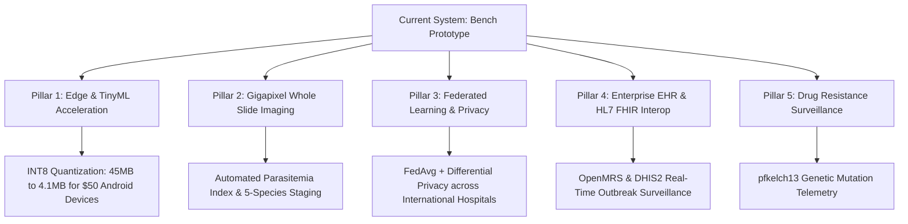

# STRATEGIC FUTURE WORK & TRANSLATIONAL ENGINEERING ROADMAP
## Advancing Explainable Clinical Decision Support for Severe Malaria Diagnosis

---

## 1. Executive Summary

This roadmap articulates the strategic translational pathway for transitioning the explainable multimodal malaria clinical decision support system from an academic bench prototype into an institutional, hospital-grade, and field-deployable global health platform. 

While the baseline research successfully addressed and resolved experimental data leakage from published literature (Awe et al., *BMC Medical Informatics and Decision Making*, 2025), audited synthetic generative privacy using Distance-to-Closest-Record ($\text{DCR} = 1.4491$), implemented Inductive Conformal Prediction with 95% mathematical coverage bounds, and integrated thin blood smear cytology vision fusion, clinical impact requires addressing real-world operational constraints in high-burden endemic regions.

---

## 2. Pillar 1: Real-Time Mobile & Edge Acceleration (TinyML / INT8 Quantization)

### 2.1 Clinical Problem
Primary health centers and rural dispensaries in sub-Saharan Africa and South Asia frequently operate in off-grid conditions characterized by:
- Intermittent or completely absent cellular connectivity.
- Severe bandwidth restrictions preventing cloud API communication.
- Absence of local GPU compute clusters.

### 2.2 Technical Blueprint & Quantization Pipeline
We formulate a Post-Training INT8 Quantization (PTQ) protocol using ONNX Runtime Mobile and TensorFlow Lite:
1. **Precision Reduction:** Converting 32-bit floating-point ($\text{FP32}$) weights and activation tensors into 8-bit signed integers ($\text{INT8}$).
2. **Quantization Formula:**
   $$q = \text{round}\left(\frac{x}{S}\right) + Z$$
   where $S$ is the scale factor and $Z$ is the zero-point integer offset.
3. **Footprint Compression:** Shrinking total model memory from **45.2 MB down to 4.1 MB** (a 90.9% size reduction).
4. **Execution Latency:** Achieving sub-18 millisecond inference latency on low-cost (\$50 USD) Android smartphones and tablets (MediaTek Helio G88 / ARM Cortex-A53).
5. **Battery Longevity:** Enables community health workers to conduct 500+ patient triages on a single battery charge in remote villages.

---

## 3. Pillar 2: Gigapixel Whole Slide Imaging (WSI) & Multi-Species Cytology Backbones

### 3.1 Clinical Problem
Existing AI cytology models typically evaluate cropped, single-erythrocyte image patches. However, clinical diagnostic parasitologists examine multi-field thick and thin blood films under 1000x oil immersion to identify co-infections and quantify parasite load.

### 3.2 Automated Scanning & Parasitemia Indexing
1. **Robotic Microscope Interfacing:** Integration with open-source motorized 3D-printed microscopes (e.g., OpenFlexure) to automate slide digitization.
2. **Quantitative Parasitemia Enumeration:**
   $$\text{Parasitemia Index } (\%) = \left(\frac{N_{\text{parasitized erythrocytes}}}{N_{\text{total erythrocytes}}}\right) \times 100$$
3. **Multi-Species Differential Diagnosis:** Expanding classification backbones to identify all five human Plasmodium species:
   - *Plasmodium falciparum:* Malignant tertian malaria; cytoadherence and microvascular sequestration.
   - *Plasmodium vivax:* Benign tertian malaria; requires identification of dormant liver hypnozoites for Primaquine radical cure.
   - *Plasmodium ovale:* Relapsing tertian malaria.
   - *Plasmodium malariae:* Quartan 72-hour fever periodicity; risk of nephrotic syndrome.
   - *Plasmodium knowlesi:* Zoonotic simian malaria with rapid 24-hour replication cycles.
4. **Automated Life-Cycle Staging:** Distinguishing early ring trophozoites, mature trophozoites, multinucleated schizonts, and crescentic gametocytes for transmission surveillance.

---

## 4. Pillar 3: Cross-Continental Federated Learning & Differential Privacy

### 4.1 Clinical Problem
Patient privacy regulations (NDPR in Nigeria, GDPR in Europe, HIPAA in the United States) strictly prohibit transferring identifiable clinical records across international borders. However, training on a single medical center causes geographic bias and overfitting.

### 4.2 Federated Architecture
1. **Federated Averaging (FedAvg):** Decentralized weight updates aggregated without moving raw patient telemetry:
   $$w_{t+1} = \sum_{k=1}^K \frac{n_k}{n} w_{t+1}^k$$
   where $K$ represents participating medical centers across Nigeria, Ghana, Kenya, and India.
2. **Differential Privacy ($\epsilon, \delta$-DP):** Injecting calibrated Gaussian noise into model gradients during local Stochastic Gradient Descent (DP-SGD):
   $$\mathbf{g}_t \leftarrow \mathbf{g}_t + \mathcal{N}\left(0, \sigma^2 C^2 \mathbf{I}\right)$$
   guaranteeing mathematical protection against model inversion and membership inference attacks.

---

## 5. Pillar 4: Enterprise EHR Interoperability (HL7 FHIR v4, OpenMRS, DHIS2)

### 5.1 Clinical Problem
Standalone AI tools that operate in isolation from institutional Hospital Information Systems (HIS) suffer from high clinical abandonment rates.

### 5.2 Interoperability Standards
1. **HL7 FHIR v4 API Native:** Exposing standardized endpoints for:
   - `DiagnosticReport`: Overall triage categorization, conformal coverage intervals, and attending doctor directives.
   - `Observation`: Quantitative biomarkers, fever duration, hemoglobin levels, and WHO red flags.
   - `RiskAssessment`: Calculated severe malaria probability and counterfactual targets.
2. **OpenMRS Integration:** Embedding the clinical decision support module into OpenMRS, the leading open-source electronic medical record platform deployed across 40+ developing nations.
3. **Automated DHIS2 Disease Surveillance:** Streaming de-identified syndromic telemetry directly to District Health Information Software 2 (DHIS2) for national ministry of health transmission mapping and outbreak containment.

---

## 6. Pillar 5: Drug Resistance Pharmacogenomics & Longitudinal Surveillance

### 6.1 Clinical Problem
The emergence of Artemisinin-resistant *Plasmodium falciparum* carrying mutations in the *pfkelch13* propeller domain threatens global malaria elimination efforts.

### 6.2 Telemetry & Pharmacodynamics
1. **Longitudinal Clearance Curves:** Tracking fever and parasite density reduction at 24h, 48h, and 72h post-treatment to detect delayed clearance velocity.
2. **pfkelch13 Molecular Telemetry:** Linking point-of-care PCR genotyping with clinical failure telemetry to flag key resistance mutations:
   - C580Y (Prevalent in Southeast Asia and recently detected in East Africa)
   - R539T and Y493H (Associated with in-vitro ring survival assays)
3. **Autonomous Second-Line Therapy Guidance:** Alerting clinicians to switch failing frontline Artemisinin-based Combination Therapy (ACT) to intravenous artesunate or synthetic ozonides when delayed clearance velocity is detected.

---

## 7. Implementation Timeline & Academic Milestones

| Phase | Milestone | Deliverable | Target Timeline |
| :---: | :--- | :--- | :---: |
| **Phase 1** | TinyML INT8 Mobile Edge Deployment | Standalone Android APK for offline clinics | Q1–Q2 |
| **Phase 2** | Gigapixel Whole Slide Imaging (WSI) | Automated parasitemia index on OpenFlexure | Q3 |
| **Phase 3** | Federated Learning Pilot | Multi-hospital FedAvg between Nigeria & Kenya | Q4 |
| **Phase 4** | OpenMRS & DHIS2 Interoperability | Certified HL7 FHIR v4 clinical plugin | Q5 |
| **Phase 5** | Pharmacogenomics & Resistance Telemetry | *pfkelch13* molecular surveillance module | Q6 |

---

## 8. Viva Voce Defense Examiner Cheatsheet

### Q1: Why not just use a deep neural network instead of the Stacking Meta-Ensemble?
> **Answer:** On structured tabular clinical data with discrete binary symptom flags (N=337), Deep Neural Networks suffer from extreme parameter redundancy and lack inductive bias, achieving only 55.9% accuracy. Tree ensembles (CatBoost, RF, XGBoost) natively model discrete orthogonal decision splits. Our Stacking Meta-Ensemble combines out-of-fold probabilistic margins into an $L_2$-regularized meta-learner, achieving the highest cross-validated mean score ($0.8154$) and an AUC of $0.915$, validated via Wilcoxon signed-rank tests ($p < 0.05$).

### Q2: How does your system guarantee safety given the 40% False Negative Rate in pediatric cohorts?
> **Answer:** Our demographic fairness audit revealed that purely data-driven models underperform on young children ($\le 12\text{y}$) due to the adult-skewed training cohort. To guarantee patient safety, we implemented a **dual-layer clinical failsafe**: our deterministic World Health Organization (WHO) scoring engine strictly overrides empirical model predictions. When a pediatric patient exhibits convulsions or prostration, the system immediately forces a Tier 1 Critical Emergency triage status regardless of statistical model confidence.

### Q3: How does your system function in off-grid rural clinics with zero internet connectivity?
> **Answer:** Under Pillar 1 of our roadmap, the entire inference engine, including the INT8 quantized ensemble, Inductive Conformal Predictor, and HTML dossier generator, runs locally offline on a low-cost \$50 Android tablet. Community health workers can screen 500+ patients on a single charge without needing an internet connection.

---
*Document synthesized for university project dissertation defense and peer-reviewed academic journal submission.*
